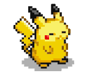

  <h1>🚀 NexusBot.NET Project Assets</h1>
  
<b>The ultimate high-performance asset bank for Pokémon automation, trading, and management.</b>

  
  
  

---

## 📖 Overview

Welcome to the **NexusBot.NET** asset repository. This project serves as the centralized visual and data hub for the NexusBot ecosystem. These assets are actively used in the original repository: [NexusBot.NET](https://github.com/NexusRisen/NexusBot.NET). It houses thousands of high-definition sprites, animated status indicators, and specialized UI elements designed for seamless integration with .NET-based Pokémon automation tools.

### ✨ Key Features
- **Total Coverage:** Complete libraries of Shiny and Non-Shiny sprites in both PNG and optimized WebP formats.
- **Dynamic UI:** Animated GIFs for bot status, trading phases, and system actions.
- **Universal Data:** Multi-language item mapping and mapping metadata.
- **Optimized Structure:** Tiered alphabetical indexing for lightning-fast asset retrieval.

---

## 📂 Repository Structure

The repository is organized into a modular hierarchy to ensure scalability and ease of maintenance.

### 🏛️ Core Assets (`/Assets`)
| Category | Description | Highlights |
| :--- | :--- | :--- |
| **🤖 Bot** | Functional UI & Status | Cloning/Dumping animations, DM status GIFs, and UI buttons. |
| **🎭 Icons** | Character & Type Visuals | High-res character sprites, elemental megaphones, and Tera-icons. |
| **🏅 Medals** | Achievements & Progress | Contest ribbons, Pokémon-style milestone markers (0000-1000), and special awards. |
| **🥚 Eggs** | Biological Assets | Type-specific animated eggs and mystery variations. |
| **👥 NPCs** | Character Sprites | Support characters like Professor Oak and field assistants. |

### 🔴 Pokéballs (`/Balls`)
*   **Main:** The standard collection of high-definition `128x128` Pokéball sprites.
*   **Alt:** A specialized library containing alternative styles and optimized sizes (`20x20`, `28x28`) for various UI contexts.

### 🐉 Sprite Libraries (`/Non-Shiny` & `/Shiny`)
The backbone of the repository, containing thousands of individual Pokémon sprites.
*   **Format-Specific:** Separated into `PNG/` and `WebP/` for different performance needs.
*   **Alphabetical Indexing:** Files are sub-divided into ranges (`A-G`, `H-N`, `O-T`, `U-Z`) to prevent folder bloat and speed up OS indexing.

---

## 🛠️ Tools & Maintenance

We maintain strict standards for all assets. The `Tools/` directory contains automation scripts to help you prepare new additions:

- **`rename.py`**: Ensures all filenames match the lowercase standard for cross-platform compatibility.
- **`press.py`**: A high-efficiency converter that generates optimized WebP versions of PNG sprites.

> **Note:** Always run these tools before committing new assets to ensure consistency!

---

## 📊 Data & Metadata

Located in the `Data/` folder, **`Item Names.txt`** provides a comprehensive translation layer:
- **Languages:** English, Chinese, Japanese.
- **Scope:** HEX ID mappings for every item in the modern Pokémon database.

---

## 🤝 Contributing

We welcome high-quality asset contributions!
1. Fork the repository.
2. Add your assets to the appropriate `Assets/` subfolder or Sprite range.
3. Ensure all files are **lowercase** and include both **PNG** and **WebP** versions.
4. Open a Pull Request with a clear description of the new assets.

---

  
  
<i>Powering the next generation of Pokémon automation.</i>

